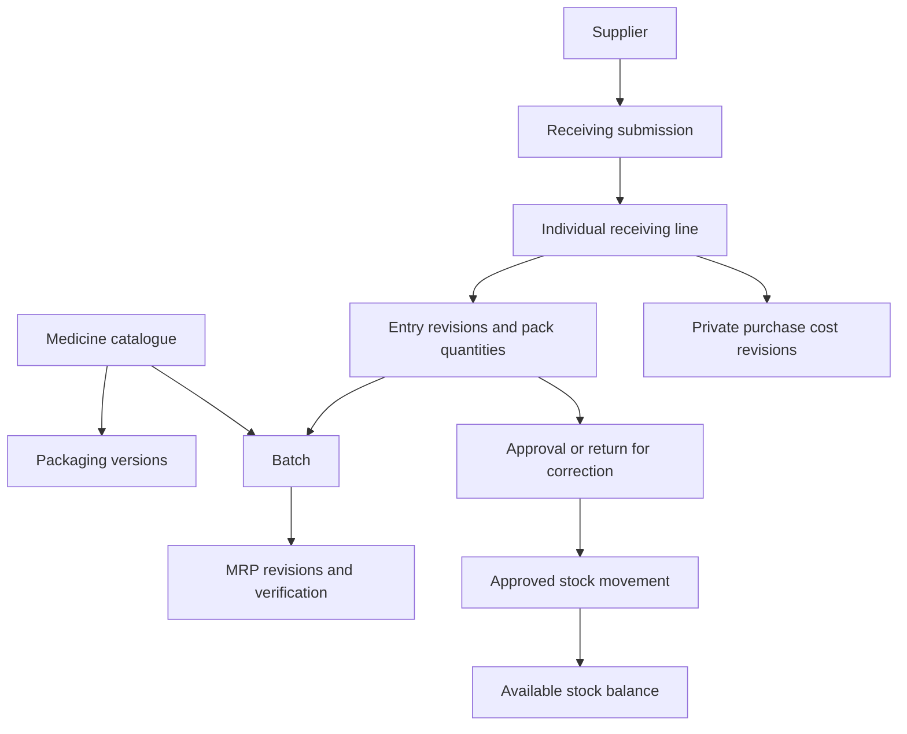

# Medicine and stock database plan

Status: the catalogue foundation now has C# models and a tested `InitialCatalogue`
migration; see [catalogue setup](catalogue-setup.md). It has not yet been applied to
the user's development database. The rest of this document remains a design plan.
The agreed requirements are in [business-rules.md](business-rules.md).
Table names and implementation details below are proposals, not additional business decisions.

## The basic idea

A table is a collection of similar records. Every record has an ID: a permanent
reference that other records can use. For example, a batch points to a medicine's
ID rather than copying its brand and ingredients into every batch.

We separate four different questions:

1. What medicine is this?
2. Which batch and printed MRP apply?
3. Has this incoming quantity been approved?
4. Has its purchase cost been entered?

Approving stock must not depend on having its purchase cost. A batch's price also
must not change merely because a newer batch of the same medicine arrives.

The arrows show relationships and workflow, not SQL foreign-key directions.

## Proposed records

| Table | Purpose | Main fields |
|---|---|---|
| `manufacturers` | Reusable manufacturer dropdown | ID, name, active flag |
| `generic_ingredients` | Reusable ingredient dropdown | ID, name, active flag |
| `dosage_forms` | Tablet, capsule, and other forms | ID, name, active flag |
| `medicines` | Product identity, without stock or price | ID, brand, manufacturer ID, dosage form ID, OTC/prescription classification, base unit, active flag |
| `medicine_ingredients` | One or more ingredients and their strengths | medicine ID, ingredient ID, strength value, strength unit, display order |
| `packaging_versions` | Versioned tablet/strip/box conversions | ID, medicine ID, version, tablets per strip, strips per box, creator and creation time |
| `medicine_barcodes` | Optional future scanner lookup | ID, medicine ID, packaging version ID, unit, barcode text |
| `suppliers` | Supplier details | ID, name, contact details, active flag |
| `batches` | Physical manufacturer batch | ID, medicine ID, batch number, expiry, selected verified MRP revision ID (optional) |
| `batch_mrp_revisions` | Printed MRP entry and verification history | ID, batch ID, revision, printed amount, currency, entered unit, tablets in entered unit, packaging version ID, review state, entered/verified by and times, source/reference |
| `receipts` | Groups entries from one delivery | ID, supplier ID, supplier document reference, received date, entered by/time |
| `receipt_lines` | Stable identity for an individually reviewed item | ID, receipt ID, current revision ID, version token |
| `receipt_line_revisions` | Preserves each submitted or corrected version | ID, line ID, revision number, batch ID, packaging version ID, base quantity, state, editor/time, correction reason |
| `receipt_line_packs` | Entered quantities and conversion snapshots | revision ID, unit, number of packs, tablets per pack, boxes per carton when applicable |
| `stock_review_events` | Who approved or returned an exact revision | ID, revision ID, action, actor/time, reason, automatic approval flag |
| `stock_movements` | Append-only stock history | ID, batch ID, source revision ID, movement type, signed base quantity, stock bucket, actor/time |
| `stock_balances` | Fast transactionally maintained quantity totals | batch ID, stock bucket, base quantity, version token |
| `purchase_cost_revisions` | Admin-only cost history | ID, receiving line ID, approved revision ID, entered amount/unit, normalized cost when defined, currency, admin/time, reason |
| `audit_events` | Traceable sensitive actions | ID, actor/time, action, affected record ID/revision, appropriately restricted change details |

Staff references will use ASP.NET Core Identity accounts. Do not build a separate
password table. Authentication and server permission checks are prerequisites to
exposing receiving, approval, pricing, or cost endpoints to real staff.

The ingredient structure supports Jardimet's two separately recorded strengths.
Strength formats for liquids and other non-tablet medicines need further examples;
do not force those products into the tablet conversion model.

## Packaging and MRP

For Jardimet, packaging version 1 contains 10 tablets per strip and 3 strips per box.
If an operator enters 2 cartons with 20 boxes per carton, the receipt preserves
those entered values and calculates 2 × 20 × 3 × 10 = 1,200 tablets.
Carton conversion is captured on the receiving revision, not silently treated as
a universal medicine setting. All conversions and quantities must be positive
whole numbers for tablets, with overflow and maximum-size validation.

`receipt_line_packs` allows mixed quantities without requiring them in the first UI.
Whether one UI line accepts mixed packs is still open; this structure can also
store a single selected unit per line.

Store printed MRP as the entered amount and its denominator (tablets per selected
unit). For BDT 600 per box containing 30 tablets, the derived rate is BDT 20 per
tablet. Preserve those original inputs even when division produces repeating
fractions. Never use binary floating-point types for money. Final decimal precision
and intermediate calculation policy must be settled before price calculations ship.

A batch may have multiple MRP revisions but only one selected active verified
revision under the initial design. Pending entries do not replace that selection.
Official effective dates and treatment of revised prices on old stock remain open.
If packages sharing a manufacturer batch number can have different simultaneous
printed MRPs, introduce separately priced stock lots before implementing batch uniqueness.

The selected MRP must belong to the same batch. Packaging used by receipt and price
records must belong to the same medicine as their batch. Enforce those relationships
with database constraints where possible as well as backend validation.

## Receiving and approval states

| Action | Resulting line revision state | Adds available quantity? |
|---|---|---|
| Operator submits | Pending approval | No |
| Admin returns it with a reason | Returned for correction | No |
| Operator corrects and resubmits | New pending revision; old revision retained | No |
| Admin approves current revision | Approved | Yes, subject to stock eligibility |
| Admin submits a new entry | Approved automatically | Yes, subject to stock eligibility |
| Admin corrects/re-enters an unapproved entry | New revision approved automatically; original superseded | Once, subject to stock eligibility |

A receipt's overall label is derived from its lines. Nine approved lines and one
pending line means partially approved, not entirely approved. Admin correction of
already-posted stock uses a future adjustment workflow; it cannot rerun receiving.

Operator-entered MRP needs verification independently of stock approval. The admin
review screen can present both decisions together without silently verifying prices.
The automatic-verification policy for an admin's own MRP entry still needs confirmation;
the user has explicitly waived extra approval for admin stock entry, not yet specified
that separate price-review behavior.

## Exactly-once approval and available stock

Approval is one database transaction: lock the current receiving line, verify its
revision and the admin's permission, validate conversions/batch details, record the
review decision, post the movement, and update the stock balance. All succeed together
or all roll back. Admin-created entries use the same posting logic.

Use a unique receiving-movement source for each approved revision and prevent more
than one revision of a logical receiving line from posting. Check the current revision
while holding the line lock so an old CSV or browser tab cannot approve superseded data.
Add request idempotency records when implementing submission/approval endpoints:
same request key and payload returns the original result; changed payload under the
same key is rejected. This also prevents duplicate new entries after network retries.

Keep pending quantities out of posted inventory. Posted stock and sellable stock
are not identical: availability additionally requires usable expiry, a verified batch
price, and absence of quarantine or other holds. Cost pending is not a sale block.
The handling of expired deliveries (reject versus receive into a non-sellable bucket)
must be decided before receiving goes live.

Existing approved stock must remain usable while another receipt for its batch is
pending. Future returns go into quarantine, never directly into available stock.
Every change to a balance must have a matching stock movement in the same transaction;
provide a reconciliation check between balances and movement totals.

Future checkout must choose usable batches by earliest expiry, conditionally deduct
stock under database locking, and save sale and movements atomically. Two cashiers
cannot both purchase the last unit. Use consistent lock ordering when multiple batches
are involved. This plan reserves that behavior; it does not implement checkout.

## Costs, permissions, and CSV review

A missing cost record means **Cost pending**, not zero. Store cost against the receiving
line because separate deliveries of one batch may have different purchase costs.
Cost-entry units and allocation of those costs to sales are unresolved. Profit reporting
cannot be finalized until that allocation and later cost completion are defined.

Only admin-specific endpoints may read or write cost records. Operator responses,
exports, and general audit feeds must exclude them. Cost information in audit history
requires the same admin permission as the original data.

The review CSV includes receipt ID, line ID, revision, supplier, medicine, batch,
expiry, entered quantities, conversions, calculated tablets, recorded MRP and its unit,
price verification status, and stock review status. Record exporter and export time.
Escape CSV cells and neutralize spreadsheet formulas in user-entered text. Export is
read-only; it neither approves stock nor grants permission to upload altered data.
CSV import is not part of this agreed workflow.

## Worked example

1. Jardimet is one medicine; its ingredients are linked to two ingredient records.
2. An older batch has verified MRP BDT 20 per tablet. A newer batch has BDT 22.
3. An operator submits 2 boxes of the older batch: 60 tablets, pending approval.
4. Available quantity does not increase yet. The admin can export and review that line.
5. The admin verifies any pending MRP and approves the line. The system posts +60
   tablets once. Purchase cost may still be pending.
6. A future sale of 5 tablets from that batch starts at BDT 100. An eligible BDT 15
   per-strip offer gives BDT 7.50 off. The final BDT 92.50 rounds to BDT 93, with
   a separate +BDT 0.50 rounding adjustment on the receipt.

Offers, sales, payments, refunds, and receipt snapshots will have their own design
phase. Their confirmed rules remain in the business-rules document: dates with optional
end date, admin manual stop, automatic best offer, no stacking, proportional pack
discounts, and final nearest-whole-taka rounding with halves up.

## Constraints and checks before implementation

- Use permanent IDs, foreign keys, required fields, and positive-quantity checks.
  Referenced historical records are deactivated or superseded, not cascade-deleted.
- Use unique version numbers within each packaging, price, or receiving history.
  Review and posting always reference a particular immutable submitted revision.
- Do not make batch number globally unique. Confirm medicine/batch identity and
  conflict handling for differing expiry or printed MRP before adding its unique key.
- Store action timestamps in UTC; define shop timezone and date-only expiry/offer
  boundaries before enforcing date rules. Preserve month-only expiry input if needed.
- Index medicine search fields, batch lookup, pending-review queries, movement source,
  batch movement history, and supplier receipt history as their queries are implemented.
- Manage schema changes with checked-in EF Core migrations. Review migration SQL;
  use a separate test database and a deliberate deployment migration step, rather
  than changing schema automatically on every production server startup.
- Before deployment, separate migration/schema-owner credentials from the backend's
  restricted runtime database account. The current development owner is not the final
  production permission arrangement.

Meaningful acceptance checks for implementation: pending stock stays hidden from
availability; partial approval releases only selected lines; repeated approval posts
once; stale revisions cannot be approved; admin re-entry supersedes the original;
unverified prices block checkout; different batches retain their own MRPs; operator
API requests cannot obtain costs or approve entries; cost pending never becomes zero;
pack conversions round-trip correctly; later price/pack edits preserve history.

## Small implementation steps

1. Build only the catalogue foundation: manufacturer, ingredient, dosage form,
   medicine, and ingredient-strength records, with a first reviewed migration.
2. Add versioned packaging and batch/MRP records after resolving their blocking details.
3. Establish staff authentication and permissions before exposing receiving/review.
4. Add receiving revisions, individual approval, CSV review, and transactional stock posting.
5. Add private purchase-cost entry after agreeing cost units and allocation.
6. Design and implement checkout/offers and their concurrency/refund tests separately.

Unresolved business rules are not reasons to invent defaults in the schema. The
catalogue foundation can proceed while expiry, effective-date, cost, and offer details
are finalized in their respective steps.
